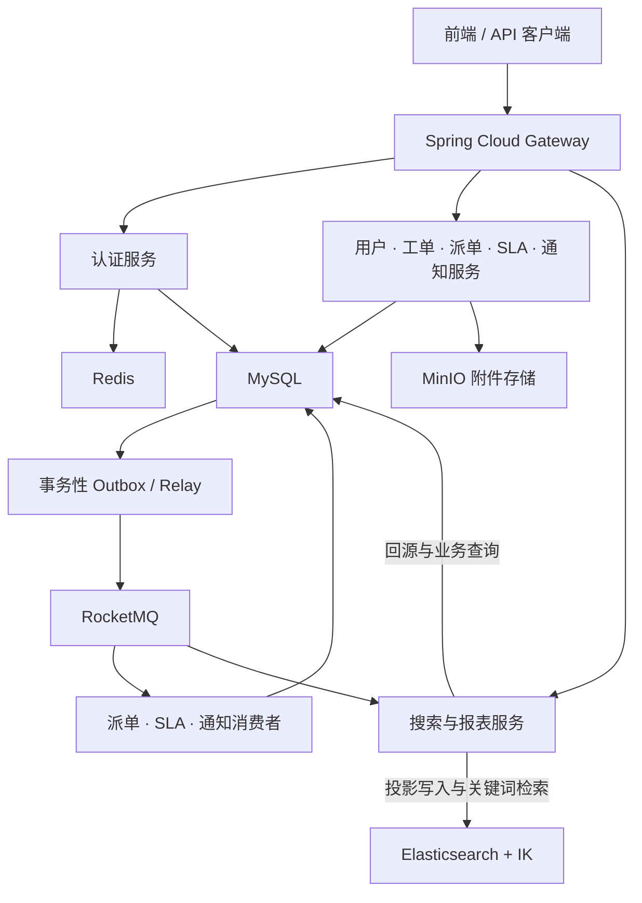

# 智能工单调度系统

**WorkOrderSystem · 微服务工单管理与调度后端**

基于 Spring Boot 和 Spring Cloud Alibaba，围绕工单提交、分配、处理、解决与关闭构建业务闭环，提供技能匹配派单、SLA 监控、通知告警、全文检索和运营报表。

本仓库为后端多模块工程。系统面向普通用户、处理人和管理员三类角色，通过统一网关提供 API。

[核心功能](#核心功能) · [架构设计](#架构设计) · [技术栈](#技术栈) · [模块结构](#模块结构) · [快速开始](#快速开始)

## 核心功能

| 角色 | 主要能力 |
| --- | --- |
| 普通用户 | 提交工单、上传附件、跟踪处理进度、回复与催办、撤销及评价 |
| 处理人 | 响应与处理工单、转派、提交解决方案、查看工作台、申请技能调整 |
| 管理员 | 管理组织与技能、配置派单和 SLA 规则、管理工单与告警、重发失败邮件、查看审计与报表 |

- **工单全生命周期**：支持自动/手动派单、响应、回复、催办、转派、升级、解决、确认、关闭与撤销，保留状态历史和操作记录。
- **技能与负载驱动的派单**：结合技能匹配、实时在办负载、历史 SLA 表现和评价进行加权评分，自动派单、手动派单与转派复用同一评分逻辑。
- **SLA 监控与自动升级**：支持分类 SLA、系统默认值、响应/解决截止时间和可配置升级规则。
- **组织与权限管理**：支持用户、部门树、处理人档案、技能标签、技能调整申请与审核，按角色限制业务访问。
- **通知与邮件投递**：提供站内信、未读数、已读管理与升级告警；邮件使用独立队列，支持失败重试、管理员单条重发和操作审计。
- **关键词检索**：使用 Elasticsearch 与 IK 分词检索工单、审计日志和用户/处理人目录，业务字段及权限仍由 MySQL 复核。
- **看板与报表**：提供管理员看板、处理人工作台、SLA 看板、评价明细和业务审计查询。
- **附件管理**：使用 MinIO 存储文件，以稳定附件 ID 关联工单和操作记录，支持上传与预览。

## 架构设计



各服务通过 Nacos 注册与发现，通过 OpenFeign 进行服务间调用。MySQL 保存业务事实，RocketMQ 驱动异步处理，Elasticsearch 保存可重建的搜索投影。

### 关键设计

- **业务写入与事件登记同事务**：事务性 Outbox 将业务修改与待发送事件一起提交，后台 Relay 负责投递，派单、SLA 和通知消费者使用幂等记录处理重复消息。
- **源版本保护搜索投影**：工单更新在 SQL 中原子递增 `source_version`；搜索消费者回源读取当前完整状态，以 ES 外部版本处理重复和乱序写入。
- **验证后发布搜索索引**：历史导入、完整验证与读别名发布分开执行，支持持久游标、断点续跑、周期对账和单工单修复；关键词查询受共享 `READY` 状态控制。
- **保留邮件原始快照**：重发复用原任务的收件地址和内容，以投递轮次、请求幂等键和审计记录控制并发重排。
- **配置与业务归属可追踪**：派单权重、升级规则等配置支持版本控制；解决与评价保留处理人归属快照，避免转派后统计归属变化。

## 技术栈

| 层次 | 技术 |
| --- | --- |
| 开发语言与构建 | Java 8、Maven 多模块 |
| 应用框架 | Spring Boot `2.3.7.RELEASE` |
| 微服务框架 | Spring Cloud `Hoxton.SR9`、Spring Cloud Alibaba `2.2.6.RELEASE` |
| 服务治理与调用 | Nacos、Spring Cloud Gateway、OpenFeign |
| 认证与授权 | Spring Security OAuth2、JWT、角色权限控制 |
| 数据持久化 | MySQL 8、MyBatis-Plus `3.4.1` |
| 消息队列 | RocketMQ、RocketMQ Spring `2.2.3` |
| 搜索 | Elasticsearch `7.12.1`、IK 中文分词、Kibana |
| 缓存与文件存储 | Redis、MinIO |
| 开发辅助 | Lombok、MapStruct |

## 模块结构

| 模块 | 默认端口 | 启动类 | 职责 |
| --- | ---: | --- | --- |
| [api-gateway](api-gateway/) | 63010 | `GatewayApplication` | 统一入口、鉴权与路由 |
| [Authentication](Authentication/) | 63071 | `AuthenticationApplication` | 登录、注册、密码重置与认证 |
| [User-Service/UserAPI](User-Service/UserAPI/) | 63070 | `UserApplication` | 用户、组织、处理人、技能及申请审核 |
| [Ticket-Service/TicketAPI](Ticket-Service/TicketAPI/) | 64060 | `TicketApplication` | 工单流转、分类、附件与评价 |
| [Assign-Engine](Assign-Engine/) | 65020 | `AssignEngineApplication` | 派单评分、候选推荐与系统配置 |
| [Sla-Monitor](Sla-Monitor/) | 63050 | `SlaMonitorApplication` | SLA 记录、超时监控与自动升级 |
| [Notification-Service](Notification-Service/) | 63030 | `NotificationApplication` | 站内信、邮件投递、重发与告警 |
| [Search-Service](Search-Service/) | 63040 | `SearchApplication` | 关键词搜索、投影同步、看板、审计与报表 |

公共模块包括 [Base-Utility](Base-Utility/)（共享模型与工具）、[Security-Common](Security-Common/)（JWT 鉴权）、[Messaging-Common](Messaging-Common/)（Outbox 与消息底座）、[Ticket-Event-Contract](Ticket-Event-Contract/) 和 [Skill-Event-Contract](Skill-Event-Contract/)（事件契约）。

`UserModel` / `UserService`、`TicketModel` / `TicketService` 为对应服务的模型与实现模块，不独立启动。[sql/](sql/) 保存建表、初始化和增量迁移脚本。

## 快速开始

以下命令在包含根 [pom.xml](pom.xml) 的目录执行，示例终端为 PowerShell。

### 1. 准备环境

| 依赖 | 版本或默认地址 |
| --- | --- |
| JDK / Maven | JDK 8、Maven 3.6+ |
| MySQL | MySQL 8，`localhost:3306` |
| Nacos | `localhost:8848` |
| Redis | `localhost:6379` |
| MinIO | `http://localhost:9000` |
| RocketMQ | NameServer `localhost:9876`，Broker `localhost:10911` |
| Elasticsearch / Kibana | `localhost:9200` / `localhost:5601`，版本 `7.12.1` |

Nacos 默认使用命名空间 ID `dev`、分组 `WorkOrder-project`。消息与 ES 功能默认关闭；使用自动派单、事件通知或关键词搜索时，需准备对应组件并开启配置。

### 2. 初始化数据库

首次部署到空库，按顺序执行：

```powershell
mysql --default-character-set=utf8mb4 -u root -p --execute="SOURCE sql/work_order_system_schema.sql"
mysql --default-character-set=utf8mb4 -u root -p WorkOrderSystem --execute="SOURCE sql/work_order_system_add_messaging.sql"
mysql --default-character-set=utf8mb4 -u root -p WorkOrderSystem --execute="SOURCE sql/work_order_system_add_ticket_search_phase3.sql"
mysql --default-character-set=utf8mb4 -u root -p WorkOrderSystem --execute="SOURCE sql/work_order_system_seed.sql"
```

全量脚本包含业务表和基础搜索结构；第二、三步补充消息表与搜索任务/对账结构，最后初始化演示账号和权限。已有数据库按缺失结构执行对应增量脚本，不重复运行全量建表脚本。

### 3. 配置连接信息

各服务的 MySQL、Nacos 等连接信息位于 `src/main/resources/bootstrap.yaml`。搜索连接与开关见 [Search-Service/application.yaml](Search-Service/src/main/resources/application.yaml)，通知邮件配置见 [Notification-Service/application.yaml](Notification-Service/src/main/resources/application.yaml)。

所有验签服务使用相同的 JWT 签名密钥，在各服务启动终端或 IDE 运行配置中设置：

```powershell
$env:OAUTH_JWT_SIGNING_KEY = "replace-with-your-development-secret"
```

数据库、对象存储和 SMTP 连接信息按实际环境配置，密码与密钥通过环境变量或受控配置注入。

### 4. 构建与启动

```powershell
mvn clean install
```

在 IDE 中运行模块表里的启动类：先启动认证、用户和搜索服务，再启动其余业务服务，最后启动网关。也可显式使用与项目一致的 Spring Boot 插件启动单个服务，例如：

```powershell
mvn -f Ticket-Service/TicketAPI/pom.xml org.springframework.boot:spring-boot-maven-plugin:2.3.7.RELEASE:run
```

网关地址为 `http://localhost:63010`，业务接口统一使用 `/api` 前缀；受保护请求携带 `Authorization: Bearer <access_token>`。

<details>
<summary>启用异步业务与关键词搜索</summary>

准备 RocketMQ，并创建 `wo-ticket-event`、`wo-skill-event` 和 `wo-ticket-search-event` Topic。相关服务开启 `WORK_ORDER_MESSAGING_ENABLED=true`，发送端开启 Outbox Relay；Search-Service 的 `work-order.messaging.outbox.enabled` 保持 `false`。

仓库提供包含 IK 的本地 ES / Kibana [Docker Compose 配置](Search-Service/docker/compose.yaml)：

```powershell
docker compose -f Search-Service/docker/compose.yaml up -d --build
```

| 环境变量 | 服务 | 用途 |
| --- | --- | --- |
| `ROCKETMQ_NAME_SERVER` | 消息生产与消费服务 | 配置相同 NameServer，默认 `localhost:9876` |
| `WORK_ORDER_OUTBOX_ENABLED=true` | 事件生产服务 | 开启后台事件投递 |
| `WORK_ORDER_ES_ENABLED=true` | Search-Service | 启用 ES 组件 |
| `WORK_ORDER_ES_URIS` | Search-Service | ES 地址，默认 `http://localhost:9200` |
| `WORK_ORDER_TICKET_SEARCH_PUBLISH_ENABLED=true` | TicketAPI | 登记工单搜索变更事件 |
| `WORK_ORDER_TICKET_SEARCH_SYNC_ENABLED=true` | Search-Service | 启用搜索消费、导入和对账 |
| `WORK_ORDER_TICKET_SEARCH_EVENT_TOPIC` | TicketAPI / Search-Service | 使用同一搜索 Topic，默认 `wo-ticket-search-event` |

工单关键词搜索需由管理员创建历史导入任务，完成验证后独立发布，确认状态为 `READY` 再开放查询。相关入口位于 [TicketSearchAdminController](Search-Service/src/main/java/com/WorkOrder/search/controller/TicketSearchAdminController.java)，网关路径为 `/api/internal/search/tickets/index/**`。

审计与目录索引在 ES 启用后自动回填或构建快照；工单同步采用独立的版本化投影。搜索未就绪时关键词请求明确报错，无关键词列表继续查询 MySQL。

</details>
